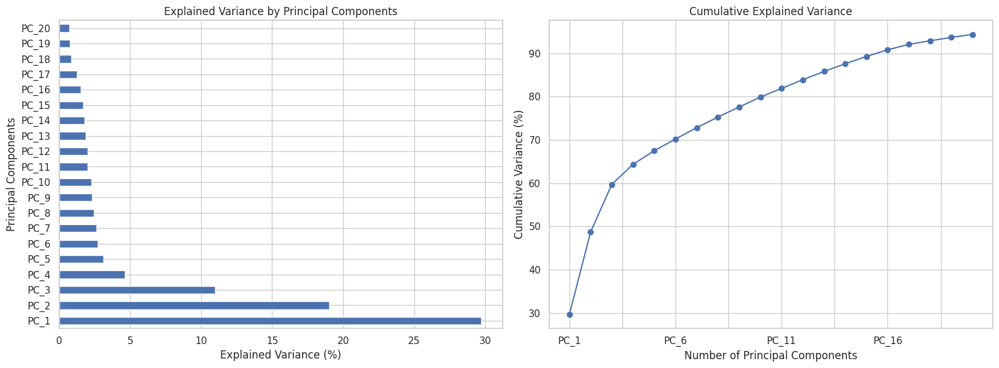
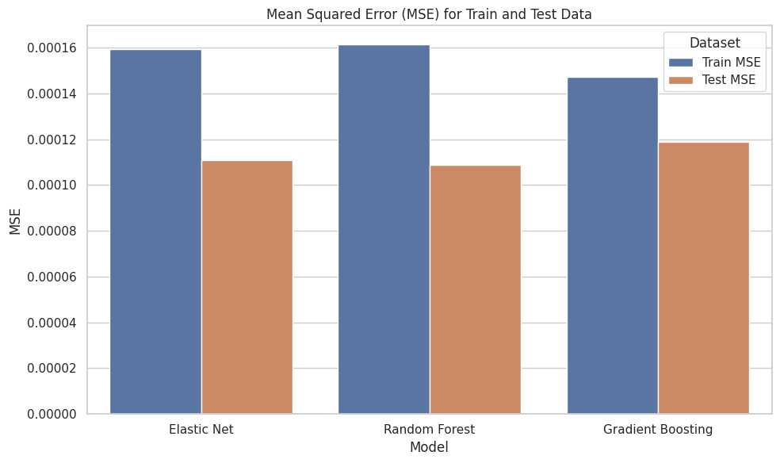
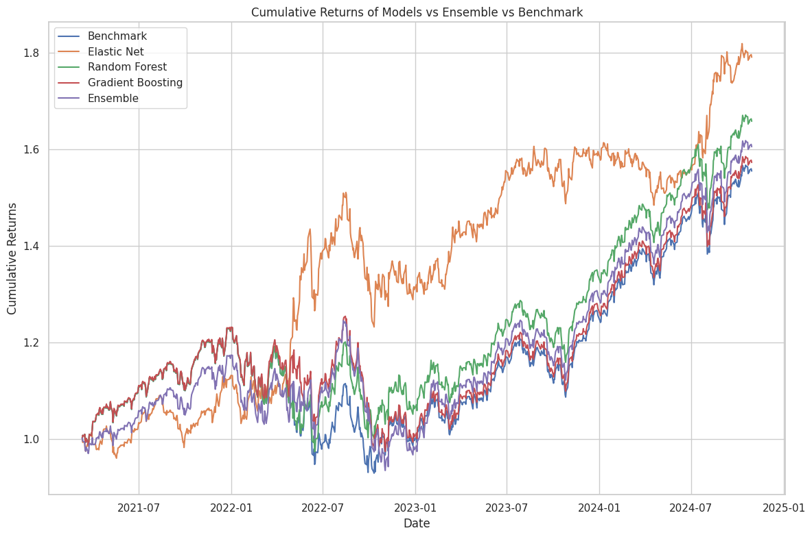

# ML-Enhanced Trading Engine


## Table of Contents
- [Overview](#overview)
- [Key Features](#key-features)
- [Methodology](#methodology)
  - [Data Pipeline & Feature Engineering](#data-pipeline--feature-engineering)
  - [Model Architecture](#model-architecture)
    - [Base Models](#base-models)
    - [Ensemble Implementation](#ensemble-implementation)
  - [Training Methodology](#training-methodology)
  - [Performance Metrics](#performance-metrics)
- [Technical Architecture](#technical-architecture)
- [Project Structure](#project-structure)
- [Installation](#installation)
- [Usage](#usage)
- [Requirements](#requirements)
- [Results and Visualization](#results-and-visualization)
- [Future Improvements](#future-improvements)
- [Contributing](#contributing)
- [License](#license)
- [Contact](#contact)

## Overview
The **ML-Enhanced Trading Engine** is a sophisticated trading system that leverages an ensemble of machine learning models with dynamic weight allocation. By combining Elastic Net, Random Forest, and Gradient Boosting models, and utilizing PCA-driven feature reduction across 100+ market indicators, the system generates robust trading signals aimed at maximizing returns while minimizing risk.

## Key Features
- **Advanced Feature Engineering**: Generates over 100 technical indicators, including volatility metrics, momentum indicators, and volume analytics.
- **PCA Dimensionality Reduction**: Reduces feature space to 20 principal components, maintaining 95% of the variance to minimize noise.
- **Ensemble Architecture**: Integrates multiple ML models with dynamic weight reallocation based on rolling performance.
- **Bias Prevention**: Implements robust methodologies to prevent look-ahead bias in all data transformations and model training processes.

## Methodology

### Data Pipeline & Feature Engineering
- **Technical Indicators**: Generates 102 technical indicators encompassing:
  - **Price-Based Metrics**: Multiple timeframe moving averages.
  - **Advanced Volatility Measures**: Including Parkinson and Garman-Klass volatility estimates.
  - **Volume-Based Indicators**: Comprehensive volume analytics.
- **Dimensionality Reduction**: Applies PCA to reduce the feature set to 20 principal components, retaining 95% of the original variance.
- **Bias Prevention**: Ensures strict data segregation to prevent look-ahead bias during feature generation and transformation.





### Model Architecture
The trading engine employs three distinct machine learning models, each contributing uniquely to the ensemble.

#### Base Models
1. **Elastic Net**
   - **Regularization**: Combines L1 and L2 penalties.
   - **Performance**: Best individual performer with a Sharpe ratio of 1.01.
   - **Advantages**: Superior generalization capabilities.

2. **Random Forest**
   - **Structure**: Utilizes tree stumps (max_depth=1) to control complexity.
   - **Performance**: Sharpe ratio of 0.92.

3. **Gradient Boosting**
   - **Learning Rate**: Conservative learning rate of 0.01.
   - **Structure**: Implements tree stumps.
   - **Performance**: Sharpe ratio of 0.79.

#### Ensemble Implementation
- **Rolling Performance Evaluation**: Assesses model performance over a 60-day rolling window.
- **Weight Reallocation Frequency**: Adjusts model weights every 15 days based on recent performance.
- **Normalization**: Utilizes softmax-based weight normalization to ensure balanced contributions.
- **Dynamic Position Sizing**: Adapts position sizes based on model confidence levels.

### Training Methodology

#### Data Separation
- **Training Period**: November 2005 – December 2020.
- **Testing Period**: January 2021 – October 2024.

#### Bias Prevention Protocol
1. **Scaling**: `StandardScaler` fitted exclusively on training data.
2. **PCA Transformation**: Learned from the training set only.
3. **Model Optimization**: Parameters optimized using training data.
4. **Hyperparameter Tuning**: Performed via cross-validation on training data.
5. **Testing**: Test set preserved for final unbiased evaluation.

### Performance Metrics
| Model              | Sharpe Ratio | Total Return | Max Drawdown |
|--------------------|--------------|--------------|--------------|
| **Elastic Net**        | **1.01**         | **74.94%**       | **-18.46%**      |
| **Random Forest**      | 0.92         | 65.85%       | -20.88%      |
| **Gradient Boosting**  | 0.79         | 52.86%       | -22.35%      |


*The Elastic Net strategy outperforms individual models by achieving the highest Sharpe ratio and total return, while maintaining the lowest maximum drawdown, demonstrating enhanced robustness and effectiveness.*

## Technical Architecture
1. **Data Processing Pipeline**
   - **Feature Generation**: Extracts features from raw price data.
   - **Dimensionality Reduction**: Applies PCA for feature compression.
   - **Standardization**: Ensures consistent data scaling across features.

2. **Model Implementation**
   - **Elastic Net**: Implements combined L1/L2 regularization for feature selection and regularization.
   - **Random Forest**: Utilizes simple tree stumps to prevent overfitting.
   - **Gradient Boosting**: Employs a conservative learning rate to enhance model stability.

3. **Ensemble Strategy**
   - **Performance Evaluation**: Continuously monitors model performance over a rolling window.
   - **Dynamic Weighting**: Adjusts model weights periodically based on recent performance metrics.
   - **Position Sizing**: Allocates capital dynamically in response to model confidence.

## Project Structure
```
ML-Enhanced-Trading-Engine/
├── main.py              
├── src/
│   ├── __init__.py
│   ├── DataManager.py
│   ├── ModelCreator.py
│   └── EnsembleVoting.py
```

## Installation

### Prerequisites
- **Python**: Version 3.8 or higher.

### Steps
1. **Clone the Repository**
   ```bash
   git clone https://github.com/yourusername/ML-Enhanced-Trading-Engine.git
   cd ML-Enhanced-Trading-Engine
   ```

2. **Create a Virtual Environment (Optional but Recommended)**
   ```bash
   python3 -m venv venv
   source venv/bin/activate  # On Windows: venv\Scripts\activate
   ```

3. **Install Dependencies**
   ```bash
   pip install -r requirements.txt
   ```

## Usage

### Running the Trading Engine
```bash
python EnsembleVoting.py
```

## Requirements
- Python 3.8+
- pandas
- numpy
- scikit-learn
- yfinance
- pandas-ta

*All dependencies are listed in the `requirements.txt` file.*

## Results and Visualization



*Provide insights and interpretations of the results to help users understand the system's effectiveness.*

## Future Improvements
- **Regime Detection Algorithms**: Incorporate algorithms to identify and adapt to different market regimes.
- **Enhanced Weight Optimization**: Explore advanced optimization techniques for better weight allocation.
- **Additional Models**: Integrate new machine learning model architectures to diversify the ensemble.
- **Transaction Cost Modeling**: Factor in transaction costs to simulate more realistic trading scenarios.
- **New Rebalancing Scheme**: Develop and test alternative rebalancing strategies to improve performance.

## Contributing
Contributions are welcome! Please follow these steps:
1. **Fork the Repository**
2. **Create a Feature Branch**
   ```bash
   git checkout -b feature/YourFeature
   ```
3. **Commit Your Changes**
   ```bash
   git commit -m "Add Your Feature"
   ```
4. **Push to the Branch**
   ```bash
   git push origin feature/YourFeature
   ```
5. **Open a Pull Request**

Please ensure that your contributions adhere to the project's coding standards and include appropriate tests.

## License
This project is licensed under the [MIT License](LICENSE).

## Contact
For any inquiries or feedback, please reach out to:

📧 **Email**: [fwoite.2024@mqf.smu.edu.sg](mailto:fwoite.2024@mqf.smu.edu.sg)

